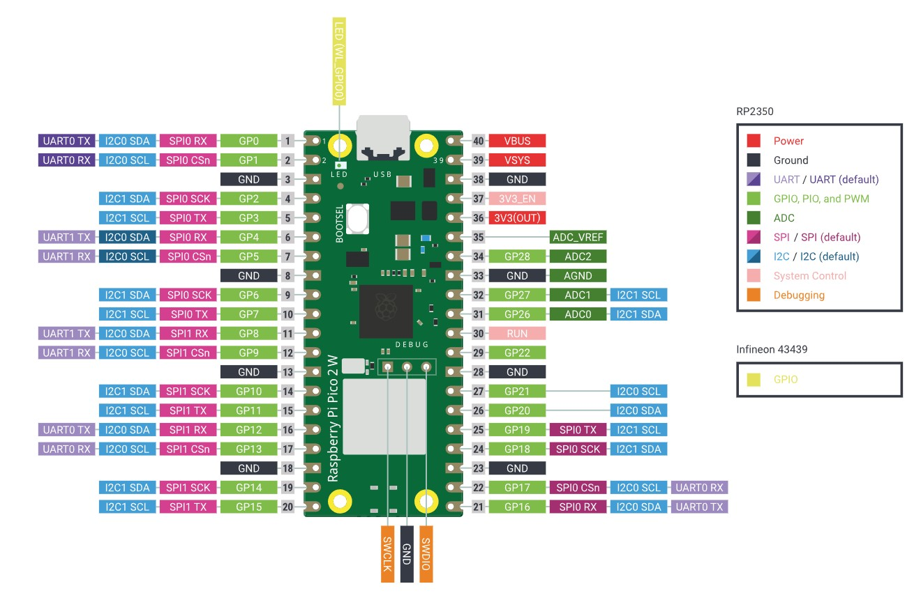
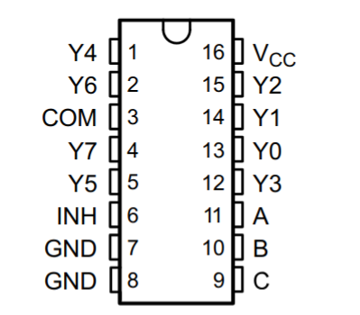

# pt100reader
Code to use a Raspberry Pico 2 as a PT100 multiplexer.

# Basic Information:

The Pico 2 has 26 GPIO pins.

The output of the OpAmp must connect to pin 26, 27, or 28. These pins expose the Pico's ADC.
The remaining pins are for the (de)mux select pins.

Each 8 channel demultiplexer has 3 select lines and 1 enable line. The select lines on the SN74LV4051AN are pins 9, 10, and 11 (A, B, and C respectively). The enable pin on the SN74LV4051AN is pin 6 (INH). Pin 3 (COM) of the SN74LV4051AN is where the current controlled output of the LM317 should connect to.
The select lines encode which output pin to enable (Y0, ..., Y7) in binary. When the enable pin is HIGH, it sets all outputs of the demux LOW.

We use the enable pin to select which demux we wish to use, and then the select lines for that demux to choose which output of that demux we wish to use.

Each demux needs 4 GPIO pins, and we need 1 GPIO pin to read the temperature signal from the OpAmp. Thus, we have a maximum of 6 3:8 demuxes per Pico (without daisy chaining). This should be suitable. 

# User's Guide:

## Dev Guide:

### Setup:

If you know what you're doing, you can ignore this section.

If you aren't using linux, you should really consider using linux. I will do my best to describe the process for windows, but I am not developing on windows.

To setup the programming environement, youu must clone the repo, create a python virtual environment, and install the required packages. This code was written in ``Python 3.11.7``.

#### Installing/configuring the programming environment:

Run the command to clone the repo:

   ``git clone [repo]``.

First, make sure you're running ``Python 3.11.7``. If you don't have it on your system, you will need to install it. Then create the virtual environement,

   ``python3.11.7 -m venv pt100``.

Then activate the virtual environement with

(linux)   ``source ./pt100/bin/activate``.

Second, you need to install packages. This is done with

   ``pip install -r requirements.txt``.

Third, you should install VSCode and install the ``MicroPico`` addon.

#### Install MicroPython on the Pico

If your Pico does not already have MicroPython, you must flash it to the device before you can connect to it and upload your MicroPython code. To do this, navigate to [https://micropython.org/download/RPI_PICO2/] and download the latest firmware. **This code is written for the Raspberry Pi Pico 2. Do not flash the wrong firmware.**

Then, hold down the ``BOOTSEL`` button on your Pico while plugging it into your computer via a micro USB cable. The Pico should display as a removable USB storage device on your computer. Then, drag and drop the firmware you downloaded into the Pico's directory. The Pico will automatically reset and be ready for use.

#### Connecting to the Pico 2 via mpremote

Connect to the Pico 2 via a microUSB cable. When you installed the dependencies from ``requirements.txt`` file, you should have installed a package called ``mpremote``. This is what we'll use to interface with the Pico from your computer. 

From your computer, run 

   ``mpremote devs``

If you don't see a Pico appear in this list, you might have forgotten to install MicroPython on the Pico. Refer to the previous step. You should see a response like 

(linux)   ``/dev/ttyACM0 fcf5dff3c1bdc758 2e8a:0005 MicroPython Board in FS mode``
(windows)   ``serial://COM3``

Features to implement:
- Configuration File with Pins to choose/disable
- Configuration GUI with Pinout of Pico
- Real time graph
- Save data locally
- Save data on dedicated database (Lab Pi)

Features implemented:
