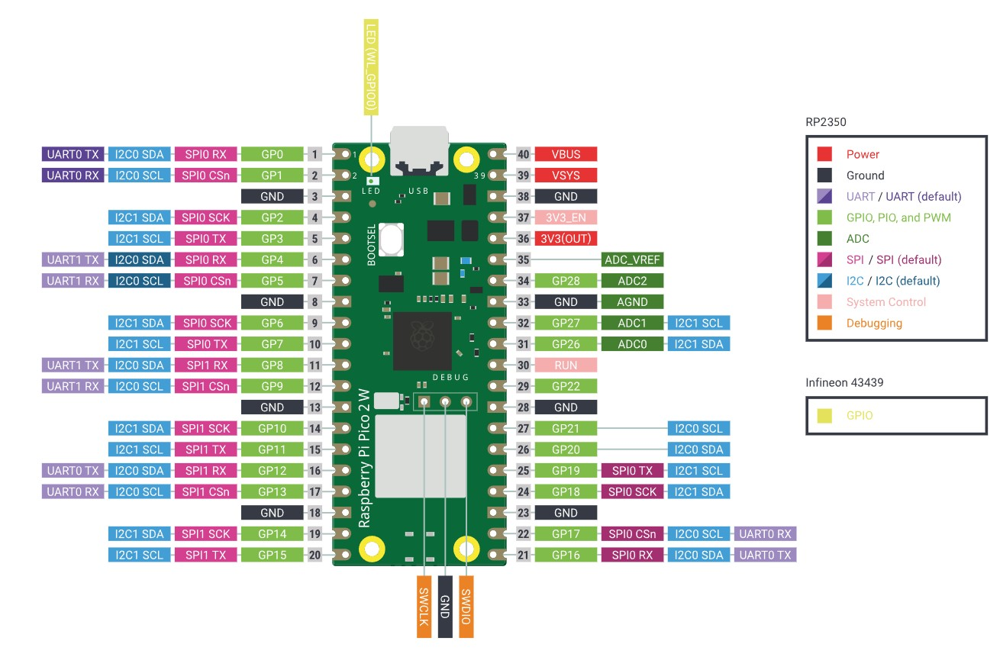

# pt100reader
Code to use a Raspberry Pico 2 as a PT100 multiplexer.

The Pico 2 has 26 GPIO pins.

The outpu

Features to implement:
- Configuration File with Pins to choose/disable
- Configuration GUI with Pinout of Pico
- Real time graph
- Save data locally
- Save data on dedicated database (Lab Pi)

Features implemented:
